# Portfolio Website untuk Digital Artist

<div align="center">
  <h3>Platform Portfolio Open-Source untuk Digital Artist & Freelancer</h3>
  <p>Website portfolio interaktif yang dibangun dengan Laravel framework untuk membantu digital artist menampilkan karya dan mengelola komisi</p>
</div>

[LIHAT LIVE WEBNYA](https://welonevisuals.online/)

---

## 📋 Tentang Project

Platform portfolio web ini dikembangkan sebagai solusi open-source untuk membantu digital artist dan freelancer dalam:
- Menampilkan portfolio karya digital mereka
- Mengelola sistem komisi dan pesanan
- Berinteraksi dengan klien melalui sistem chat terintegrasi
- Membangun reputasi melalui sistem review dan rating

Project ini dikembangkan menggunakan metodologi Research & Development dengan pendekatan ADDIE (Analysis, Design, Development, Implementation, Evaluation).

---

## catatan
## Ini cara gak mau ribet atau mau jalanin web di local server sendiri (localhost:8000)(127.0.0.1) untuk costomisasi
- (part 1)
1. download full resources frameworknya di [Disini](https://drive.google.com/file/d/1J_bjNP6ahAYfZfxWfYLS7Y26_4CxymeJ/view?usp=drive_link). knpa intall lewat link bang kan ada github bisa download?? iya emang bisa di download cuman ada file yang harus di konfigurasi lagi lewat terminal, misal folder vendor, storage, dan lain lain dia gak lengkap.
- (part 2 penginstalan softwere)
2. install laragon
3. masukkin file "C:\laragon\www" cuman copy paste jangan lupa di ekstrak filenya
4. jalankan laragonnya. jika muncul pop up laragon close aja, lihat di laragonnya itu sudah jalan mysql,apache dan mailpit udah ke kanan togglenya, trus klik "Terminal" di laragonnya
5. lalu ketik di terminalnya "code nama-file-projectnya" lalu tekan enter itu akan membuka langsung otomatis projectnya di vscode, sbelumnya harus insttall vscode.
6. cara cepat check foldernya tinggal ketik "ls" di terminal akan muncul nama foldernya.
7. kemudian pastikan udah download composernya, kalo blum langsung ke web sitenya download dan install. ketik aja di google composer, klik download, cari Composer-setup.exe
- (part 3 jalanin aplikasinya)
8. kembali ke vscode. untuk ngejalanin websitenya, pertama harus migrate dulu databasenya, copy paste ini "php artisan migrate:fresh" ini akan secara otomatis terinstall di backend laragonnya di databese mysql.
9. trus admin seedernya di jalani ini untuk login sebagai admin atau artist yang mengeloala website ini copy paste "php artisan db:seed --class=AdminSeeder" ini akan muncul email dan password di terminal.  tambahan paste ini "php artisan storage:link" ini apa bang?? ini tu tempat penyimpanan data berupa gambar,video,gif smua tersimpan folder storage. klo misalkan muncul "link already exists." berati tinggal jalnkan saja upload data nya di web server untuk testing.
10. jalanin web nya dengan copy paste "composer run dev" sabar harus menuggu prosesnya, ketika udah selesai muncul web server localhost dengan port 8000, itu klik caranya arah kursornya di link tersebut kmudian Ctrl+klik kiri akan membuka web nya. web nya sudah jalan di server kita sendiri, ini bukan global server yang bisa di akses kita semua, hanya bisa di akses di komputer atau laptop kita sendiri.
**selesai**

---

## 📸 Screenshot Aplikasi

### 1. Halaman Utama - Dashboard
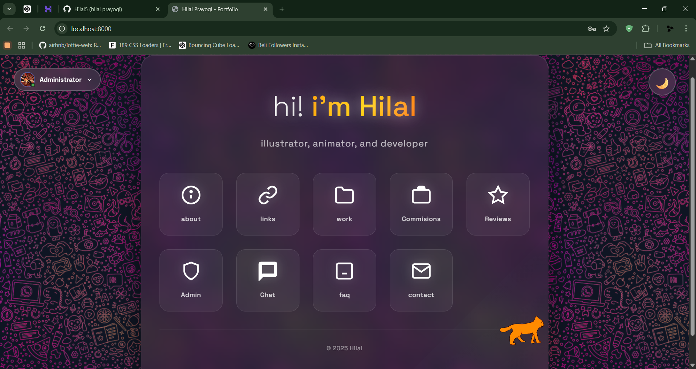

### 2. About
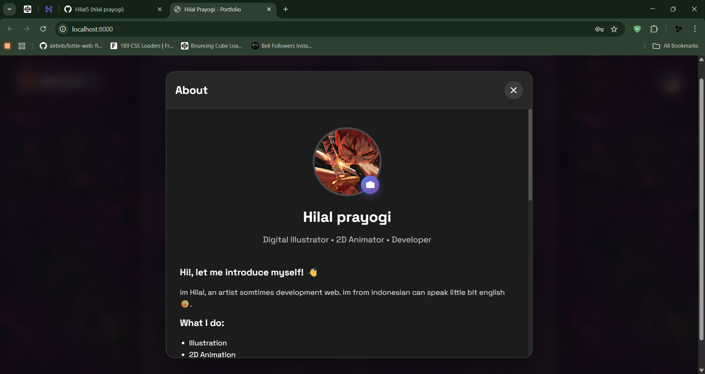

### 3. Found artist link
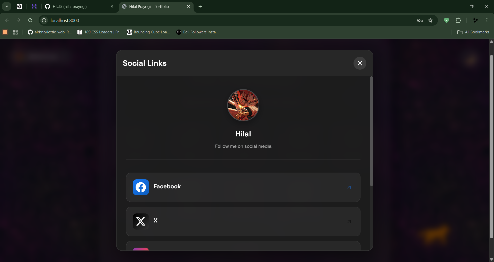

### 4. work project
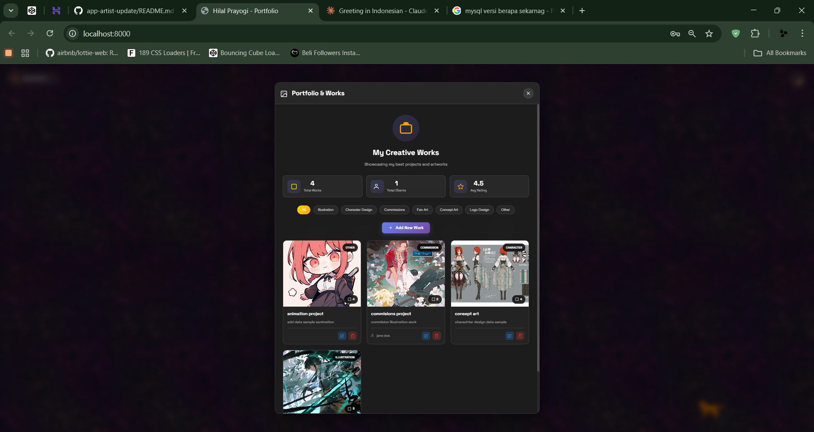

### 5. Commsisions
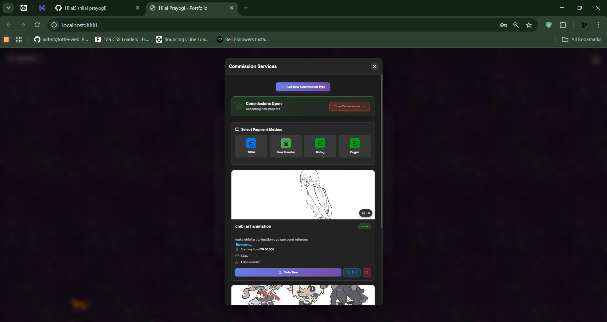

### 6. Ratting adn review
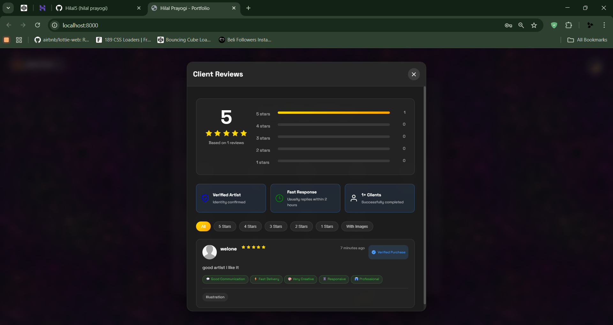

### 7. Admin manage review
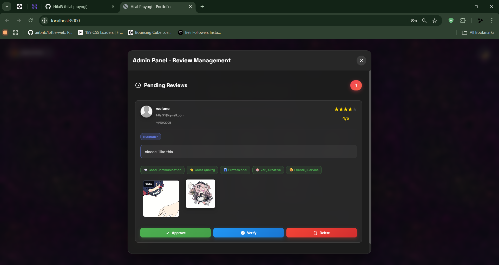

### 8. Chat fitur realtime
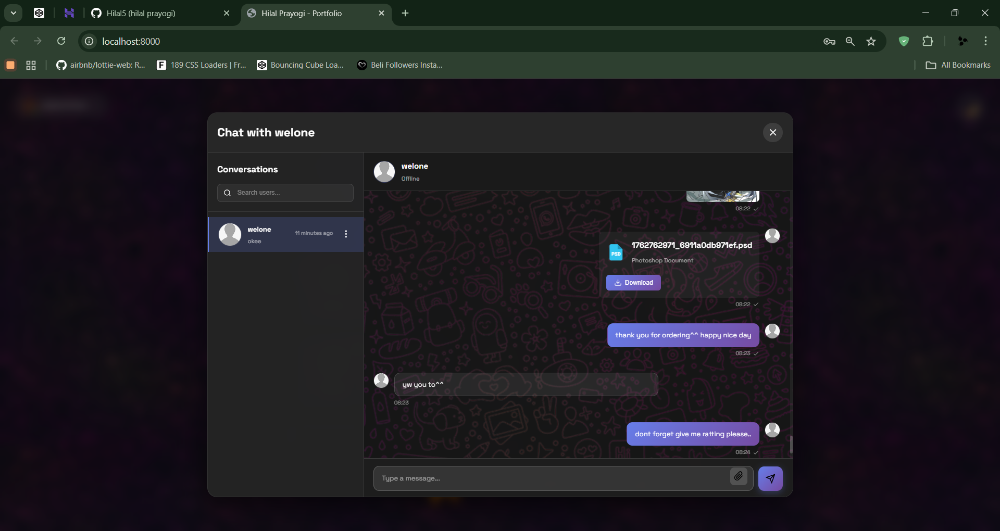

### 9. faq
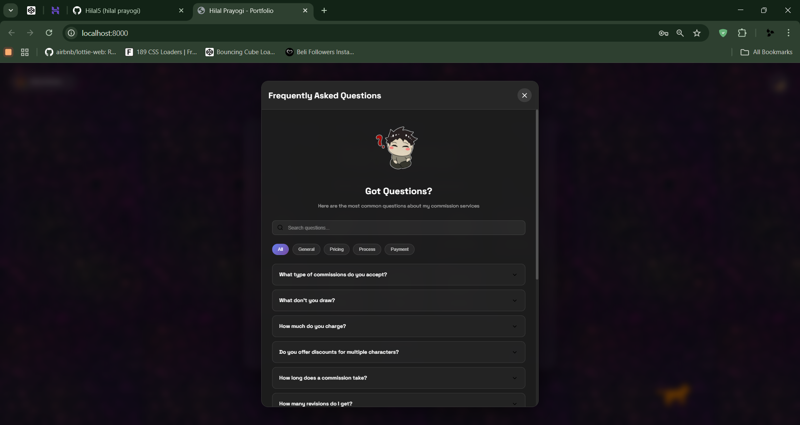

### 10. contact
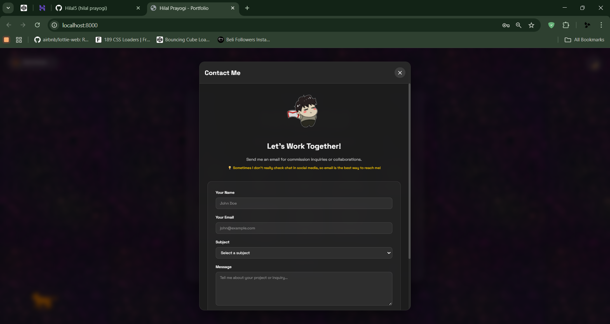

### 11. about full interface
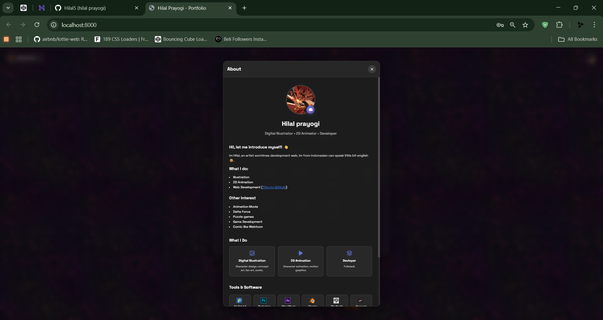


## ✨ Fitur Utama

### Untuk Artist
- 🎨 **Portfolio Management** - Upload dan kelola karya digital dengan galeri interaktif
- 💼 **Sistem Komisi** - Terima dan kelola pesanan komisi dari klien
- 💬 **Live Chat** - Komunikasi real-time dengan klien
- ⭐ **Review & Rating** - Sistem review untuk membangun kredibilitas
- 👤 **Profile Kustomisasi** - Personalisasi halaman profile artist
- 📊 **Dashboard Analytics** - Pantau performa dan statistik portfolio

### Untuk Klien/Pengunjung
- 🔍 **Browse Artists** - Temukan artist berdasarkan style dan spesialisasi
- 📝 **Request Komisi** - Buat permintaan komisi dengan detail lengkap
- 💳 **Sistem Pembayaran** - Proses transaksi yang aman dengan proses dp 3 tahap.
- ⭐ **Leave Reviews** - Berikan rating dan review untuk artist
- 🔔 **Notifikasi** - Update real-time untuk status chat dan lain sebagainya

### Untuk Admin
- 👥 **User Management** - Kelola user, artist, dan konten
- 📊 **Dashboard Admin** - Monitoring aktivitas platform
- 🚫 **Moderasi Konten** - Review dan moderasi karya yang diupload

---

## 🛠️ Teknologi yang Digunakan

- **Backend Framework:** Laravel 12.x
- **Frontend:** Blade Templates, CSS, JavaScript
- **laragon**
- **Database:** MySQL
- **Authentication:** di buat sendiri
- **File Storage:** Laravel Storage
- **Real-time Features:** dari js
- **Animation css** dari css

---

## 📦 Instalasi

### Prasyarat
- PHP >= terupdate
- Composer
- MySQL >= terupdate
- Node.js & NPM
- Git

### Langkah Instalasi

1. **Clone Repository**
```bash
git clone https://github.com/username/portfolio-artist-laravel.git
cd portfolio-artist-laravel
```

2. **Install Dependencies**
```bash
# Install PHP dependencies
composer install

# Install JavaScript dependencies
npm install
```

3. **Setup Environment**
```bash
# Copy file environment
cp .env.example .env

# Generate application key
php artisan key:generate
```

4. **Konfigurasi Database**

Edit file `.env` dan sesuaikan dengan konfigurasi database Anda:
```env
DB_CONNECTION=mysql
DB_HOST=127.0.0.1
DB_PORT=3306
DB_DATABASE=nama_database
DB_USERNAME=username_database
DB_PASSWORD=password_database
```

5. **Migrasi Database**
```bash
# Jalankan migrasi
php artisan migrate

# (Optional) Jalankan seeder untuk data dummy
php artisan db:seed
```

6. **Setup Storage**
```bash
# Create symbolic link untuk storage
php artisan storage:link
```

7. **Compile Assets**
```bash
# Development
npm run dev

# Production
npm run build
```

8. **Jalankan Aplikasi**
```bash
# Start development server
php artisan serve
```

Aplikasi dapat diakses di `http://localhost:8000`

---

## 🚀 Deployment

### Persiapan Production

1. **Set Environment ke Production**
```env
APP_ENV=production
APP_DEBUG=false
```

2. **Optimize Application**
```bash
# Cache konfigurasi
php artisan config:cache

# Cache routes
php artisan route:cache

# Cache views
php artisan view:cache

# Optimize autoloader
composer install --optimize-autoloader --no-dev
```

3. **Compile Assets untuk Production**
```bash
npm run build
```

### Hosting Options
- VPS (Hostinger, DigitalOcean, dll)
- Shared Hosting dengan PHP support
- Platform-as-a-Service (Railway, Heroku, dll)

---

## 📁 Struktur Project

```
portfolio-artist-laravel/
├── app/
│   ├── Http/
│   │   ├── Controllers/      # Controllers
│   │   └── Middleware/       # Custom middleware
│   ├── Models/               # Eloquent models
│   └── Services/             # Business logic
├── database/
│   ├── migrations/           # Database migrations
│   └── seeders/              # Database seeders
├── public/
│   ├── css/                  # Compiled CSS
│   ├── js/                   # Compiled JavaScript
│   └── uploads/              # User uploads
├── resources/
│   ├── views/                # Blade templates
│   ├── css/                  # Source CSS
│   └── js/                   # Source JavaScript
├── routes/
│   ├── web.php               # Web routes
└── storage/
    └── app/
        └── public/           # Public storage
```

---

## 🎯 Roadmap & Future Development

- [ ] Implementasi sistem pembayaran still manual dengan 3 proses tahapan dp
- [ ] Notifikasi real-time
- [ ] Mobile responsive optimization
- [ ] mobile app
- [ ] Social media integration
- [ ] Portfolio dashboard

---

## 🤝 Kontribusi

Kontribusi sangat diterima! Berikut cara berkontribusi:

1. Fork repository ini
2. Buat branch fitur baru (`git checkout -b feature/AmazingFeature`)
3. Commit perubahan (`git commit -m 'Add some AmazingFeature'`)
4. Push ke branch (`git push origin feature/AmazingFeature`)
5. Buat Pull Request

---

## 📝 Lisensi

Project ini dikembangkan untuk keperluan penelitian tugas akhir dan bersifat open-source. Anda bebas menggunakan, memodifikasi, dan mendistribusikan dengan tetap mencantumkan kredit kepada pengembang asli.

---

## 👨‍💻 Pengembang

Dikembangkan oleh **Hilal** sebagai bagian dari penelitian tugas akhir.

---

## 🙏 Acknowledgments

- Laravel Framework
- CSS
- Javascript
- Komunitas digital artist Indonesia

---

<div align="center">
  <p>Dibuat dengan ❤️ untuk komunitas digital artist</p>
  <p>⭐ Star project ini jika bermanfaat!</p>
</div>


**this is project open source, if u need this app u can use it dont pay me it is free, im happy for helping people**
